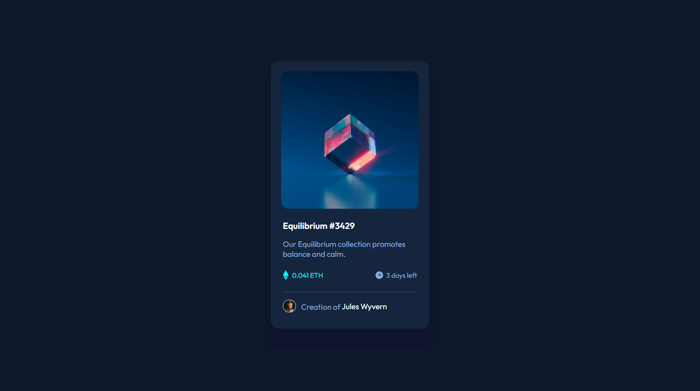
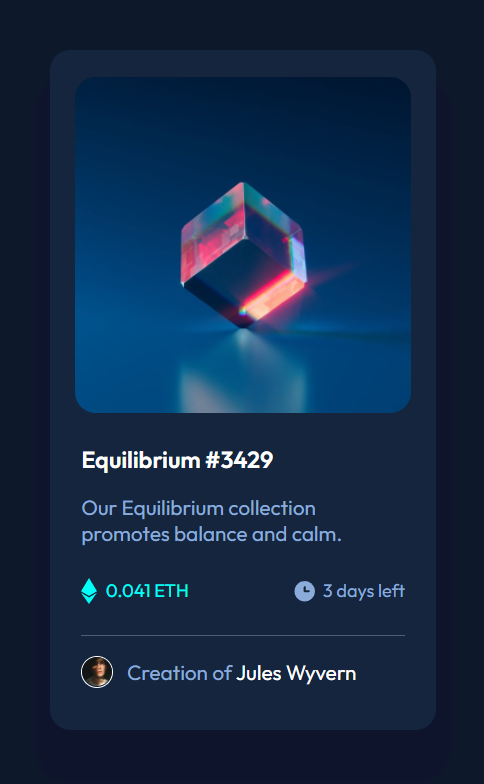

# NFT preview card component

## Table of contents

- [Overview](#overview)
  - [The challenge](#the-challenge)
  - [Screenshot](#screenshot)
  - [Links](#links)
- [My process](#my-process)
  - [Built with](#built-with)
  - [What I learned](#what-i-learned)
  - [Useful resources](#useful-resources)
- [Author](#author)

## Overview

### The challenge

Users should be able to:

- View the optimal layout depending on their device's screen size
- See hover states for interactive elements

### Screenshot

Desktop preview and Mobile preview




### Links

- Solution URL: [](https://github.com/abhishek372/Frontend-webpages/tree/main/NFT%20preview%20card%20component)
<!-- - Live Site URL: [Add live site URL here](https://your-live-site-url.com) -->

## My process

### Built with

- Semantic HTML5 markup
- CSS custom properties
- Flexbox
- Mobile-first workflow

### What I learned

Use this section to recap over some of your major learnings while working through this project. Writing these out and providing code samples of areas you want to highlight is a great way to reinforce your own knowledge.

To see how you can add code snippets, see below:

```html
<div class="coin">
                <div class="coin_count"><span>0.041 ETH</span></div>
                <div class="days"><span>3 days left</span></div>
</div>
```
```css
.content {
    padding-left: 1.2rem ;
    padding-right: 1.2rem ;
    color: hsl(215, 51%, 70%);
    display: flex;
    flex-direction: column;
    gap: 1rem;
    position: relative;
}
```


### Useful resources

- [HTML link](https://developer.mozilla.org/en-US/docs/Web/HTML) - This helped me writing efficient HTML code.
- [CSS tricks link](https://css-tricks.com/) - This is an amazing article which helped me understand CSS. I'd recommend it to anyone still learning this concept.


## Author

- Website - [Abhishek Kumar](https://www.my-site.com)
- Frontend Mentor - [@abhishek372](https://www.frontendmentor.io/profile/abhishek372)
- Twitter - [@Abhishe50609111](https://twitter.com/Abhishe50609111)
